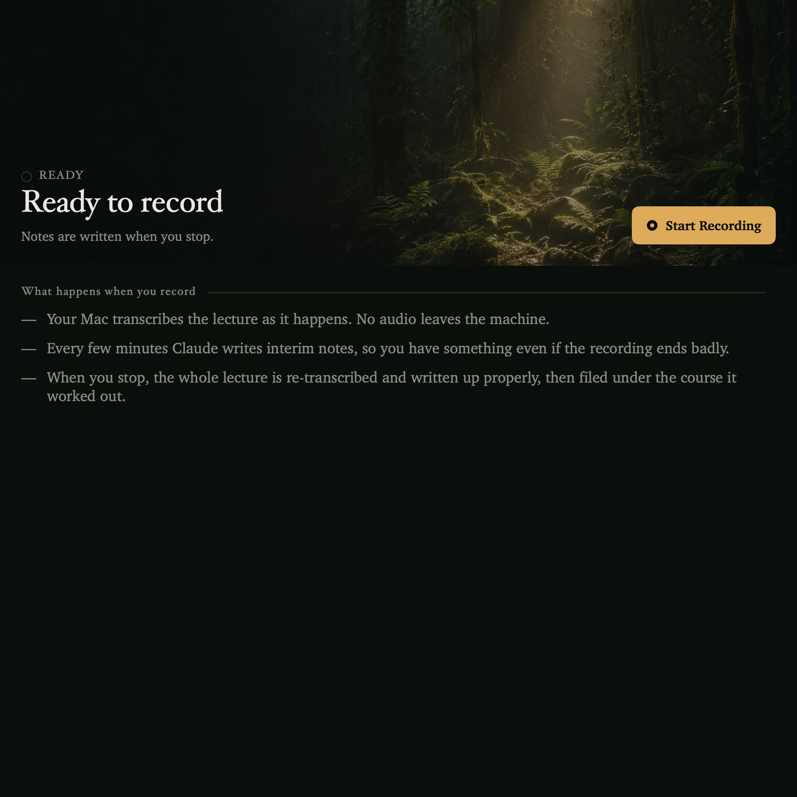
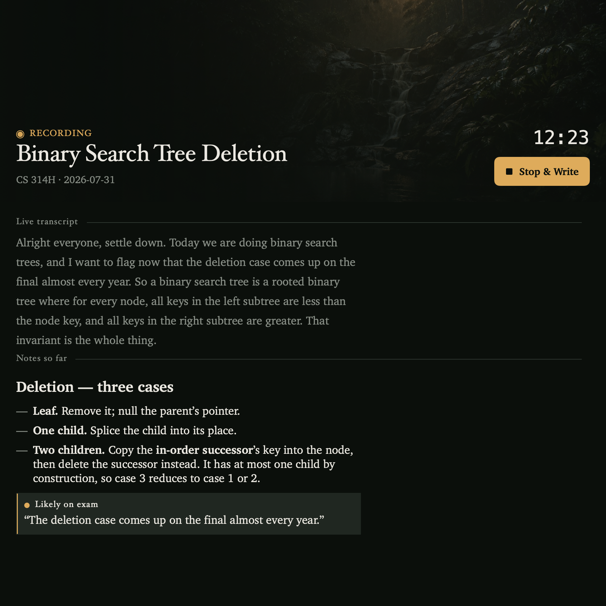
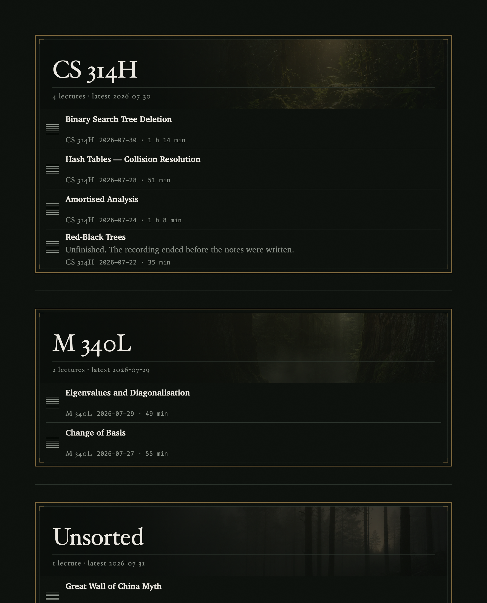
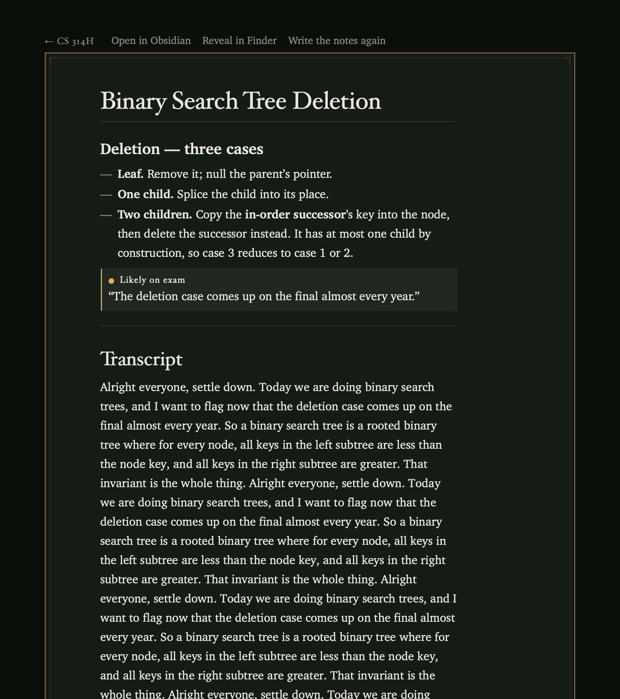
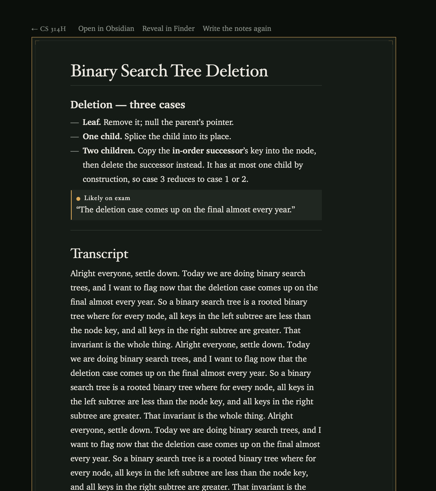
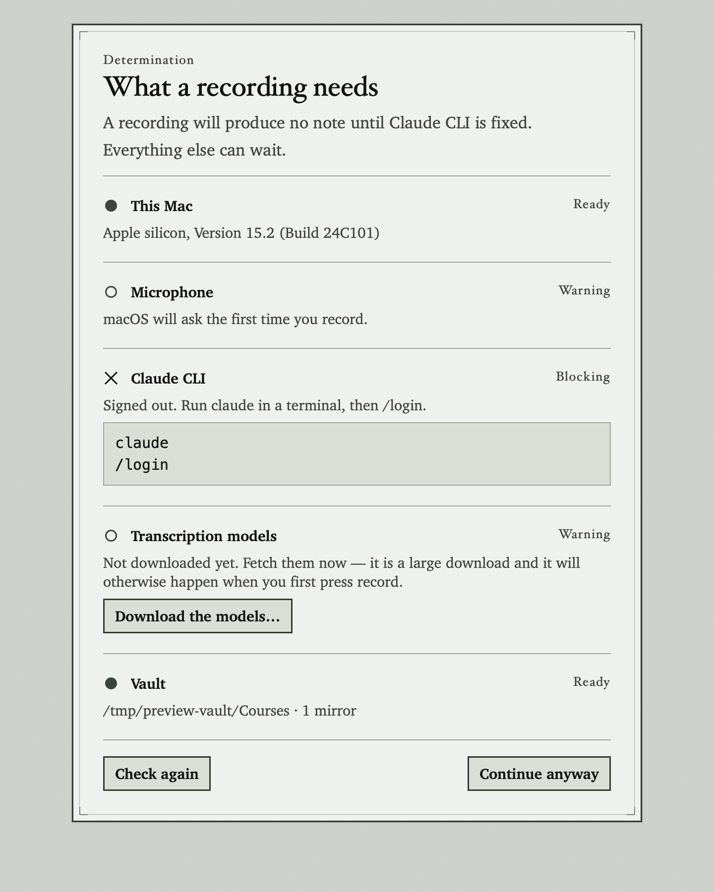
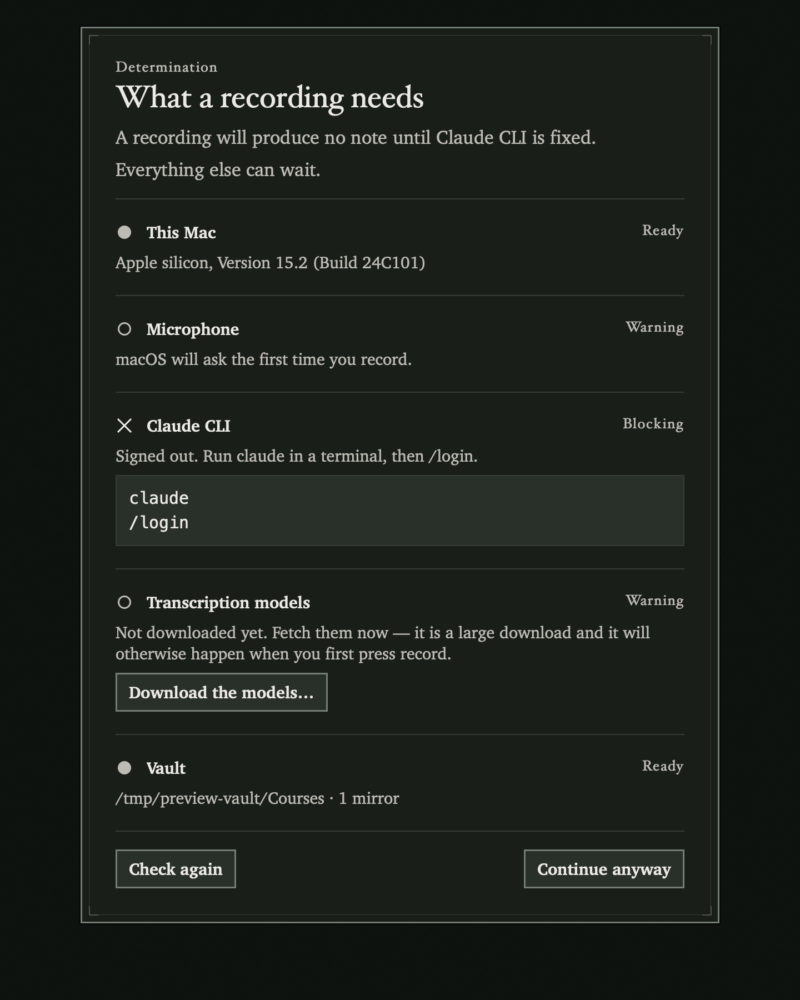
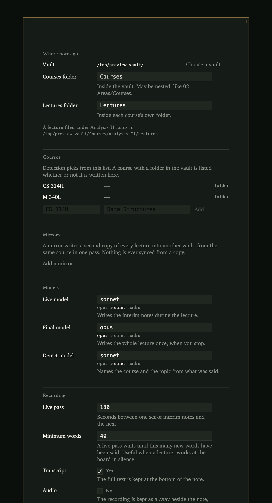
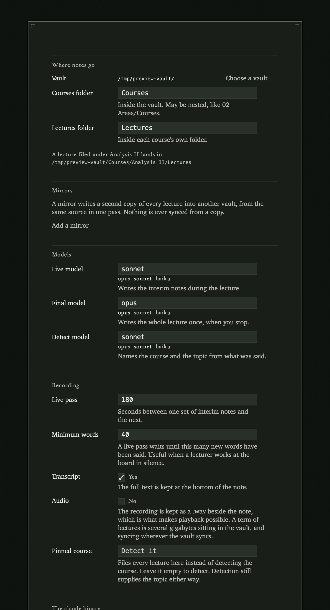

# Lecture Notes

**[lecture-notes-mac.vercel.app](https://lecture-notes-mac.vercel.app)**

**Record a lecture; it is transcribed on this Mac's Neural Engine, and no audio
ever leaves the machine.** Structured study notes — summary, key terms, likely
exam material, open questions, full transcript — are then filed into your
Obsidian vault under the course the lecture belongs to, which the app works out
from what the lecturer says.

A PDF or a web page can be written up the same way: its text is read on this Mac
— including scans, which are read with on-device OCR — and the notes are filed
under the course it belongs to, exactly as a lecture is. As with a lecture, the
**text** is sent to Claude because that is what the notes are written from; the
PDF and the page are read locally.

This is the native macOS successor to
[lecture-notes](https://github.com/toyeshhm/lecture-notes), the Python CLI that
does the same job in a terminal. Same pipeline, same vault layout, same
`config.toml` — the app reads the CLI's config on first run, so an existing
setup carries over and both can write into the same vault. What the app adds is
a menu bar extra you can start from mid-sentence, a live transcript while the
lecture is happening, and a place to read the notes back that was designed for
reading forty thousand words a term.

Transcription is Parakeet TDT v3 running through CoreML, via
[FluidAudio](https://github.com/FluidInference/FluidAudio) — local, and free.
Note-writing goes through the `claude` CLI, so it draws on a Claude subscription
you already pay for rather than metered API credit. To be exact about what that
means for privacy: the recording never leaves this Mac, but the **text** of the
transcript is sent to Claude, because that is what the notes are written from.

---

## Screenshots

Light and dark are not inversions of each other. Light is a specimen sheet on a
mounting board in daylight; dark is the same sheet under a lamp at 11pm, which
is when a first-year actually reads a lecture back. The design system is written
up in [DESIGN.md](DESIGN.md).

**Recording.** One screen for both states: the same hero, title and button
whether you are about to record or already are, because the moment they change is
the moment a lecture is starting and swapping the pane out then is how you lose
your place. The transcript arrives as it is confirmed.

| Idle | Recording |
|---|---|
|  |  |

**The library.** A term of lectures as a collection. Courses are told apart by
their scene, not by a colour.

| Light | Dark |
|---|---|
|  |  |

**The note reader.** 17pt Charter, a 68-character measure at every window size,
with code blocks and tables set to survive a 100-column listing.

| Light | Dark |
|---|---|
|  |  |

**The determination slip.** Everything that has to be true before a recording
produces a note, checked while there is still time to fix it — and each failure
carries the button that fixes it.

| Light | Dark |
|---|---|
|  |  |

**Settings.** Vault, courses folder, models, mirrors.

| Light | Dark |
|---|---|
|  |  |

Every image above is generated by `make snapshots`, which renders the real view
hierarchy offscreen. The full set — menu bar states, sidebar, model download,
empty and failure states — is in [`Snapshots/`](Snapshots/).

## Requirements

> **The one that catches people: you need the `claude` CLI installed and logged
> in to a Claude subscription.** The app spawns it to write the notes. Without a
> login you get a recording and a transcript and no notes at all.

| | |
|---|---|
| **Apple silicon Mac** | M1 or later. The ASR models run on the Neural Engine through CoreML; there is no Intel path and no CPU fallback. |
| **macOS 14 (Sonoma) or later** | |
| **`claude` CLI, logged in** | `npm install -g @anthropic-ai/claude-code`, then run `claude` and `/login`. A Pro or Max subscription is what makes this free-at-the-margin. An `ANTHROPIC_API_KEY` also works, but bills per token. |
| **An Obsidian vault** | Or any folder. The notes are plain markdown with YAML frontmatter; Obsidian is where they are pleasant to read, not where they have to live. |
| **~600 MB disk** | One-time model download on first launch. |

The app checks all of this on first run and again from Settings, and tells you
which pane or command fixes whatever is missing.

## Install

### From a release zip

Download the latest `LectureNotes-*.zip`, unzip it, and drag `LectureNotes.app`
into `/Applications`.

**Then read the next section before you double-click it.** It will not open.

### Opening it the first time

This app is **not notarized**, and never claims to be. The developer has no
Apple Developer account, so there is no Developer ID certificate to sign with
and nothing to submit to Apple's notary service. The app carries an **ad-hoc
signature** instead — a signature that proves the bundle has not been altered
since it was built, and proves nothing whatsoever about who built it.

macOS attaches a quarantine flag to anything a browser downloads. On a
quarantined app with no notarization, Gatekeeper refuses the double-click
outright and offers you the Trash. Two ways past it, both of which do the same
thing:

**Open it, get refused, then allow it.** Double-click the app and let macOS
refuse. Go to **System Settings › Privacy & Security**, scroll to the Security
section, and click **Open Anyway** beside the message naming the app. Confirm,
and it launches from then on.

Older instructions tell you to Control-click and choose Open. That worked up to
macOS 14. Sequoia removed the Control-click override for apps that are not
notarized, so on macOS 15 and later the path above is the only one through the
interface.

**Or strip the flag yourself:**

```bash
xattr -dr com.apple.quarantine /Applications/LectureNotes.app
```

Either way, you are the one vouching for the binary. If that is not a trade you
want to make, build it from source — the section below — and the quarantine
flag never gets attached in the first place.

### From source

```bash
git clone https://github.com/toyeshhm/lecture-notes-app.git
cd lecture-notes-app
brew install xcodegen
make app
open .build-xcode/Build/Products/Debug/LectureNotes.app
```

`make release` produces the signed, zipped bundle in `dist/` instead.

> **Expect to grant microphone access more than once.** macOS keys microphone
> permission to an app's code signature, and an ad-hoc signature is regenerated
> from scratch on every build. So a rebuild can produce a bundle macOS considers
> a different app, and the permission you granted the last one does not carry
> over — you get the prompt again, or the app appears in System Settings ›
> Privacy & Security › Microphone with the switch off. This looks exactly like a
> bug and is not one. A Developer ID signature would be stable across builds;
> see above for why there isn't one.

## Where the notes go

You choose a vault, a courses subdirectory and a lectures subdirectory; the
course folder itself comes from detection, and is created if it does not exist.

```
MyVault/                                              ← vault
  Courses/                                            ← courses subdirectory
    CS 314H/                                          ← detected from the lecture
      Lectures/                                       ← lectures subdirectory
        2026-09-02 — Binary Search Tree Deletion.md   ← written for you
    M 408D/
      Lectures/
        2026-09-02 — Alternating Series Test.md
    _Unsorted/
      Lectures/
        2026-09-04 — Course Administration.md         ← detection wasn't sure
```

Worked example: you record a Wednesday lecture on 2 September 2026. Detection
reads the first stretch of transcript, matches it against the course folders
already in `Courses/` and against a `courses.md` roster if you keep one, and
returns `CS 314H` with a topic of `Binary Search Tree Deletion`. The note lands
at `MyVault/Courses/CS 314H/Lectures/2026-09-02 — Binary Search Tree
Deletion.md`, with `course:`, `date:`, `duration_min:` and `status:` in the
frontmatter and a `lecture` tag.

If detection is *not* confident, the note goes to `_Unsorted/` with a warning
callout at the top of it and the guess recorded in frontmatter. Detection runs
again at the end of the lecture; if the answer changes, the note moves itself
rather than leaving a duplicate behind.

The library is read straight off the vault every time — there is no index and no
cache. Rename, move or delete a note in Obsidian and the app agrees with you on
the next scan. Notes written by the Python CLI show up without a migration step,
because they are the same files.

## What it does not do

**It is not notarized, and it is not sandboxed.** Covered above for the first;
the second is because the app spawns the `claude` binary and writes into a vault
that lives wherever you keep it, and neither is possible inside an App Sandbox
container. That also rules out the Mac App Store.

**It needs a Claude subscription, and it will spend it.** Note-writing is one
detection pass, a live pass every few minutes during the lecture, and one final
pass over the whole transcript. That draws on your normal Claude usage limit —
it is not a separate or unlimited pool. Raising the live interval or picking a
smaller live model in Settings spends less.

**First launch downloads several hundred megabytes of CoreML models.** About 600
MB, once. Do it at home rather than in the ninety seconds before a lecture
starts; the download screen exists precisely so you find out early.

**It will not guess a course.** A lecture it cannot identify confidently goes to
`_Unsorted/` and says so. A misfiled note quietly corrupts revision material
months later, which is worse than an unfiled one you can see.

**The notes are a study aid, not a record.** They are generated from ASR output
and can misattribute or omit things. Check anything that matters against the
lecture itself, and don't submit them as your own work.

**Check your institution's policy before recording a lecture.** Many require
explicit permission; some prohibit it. Consent requirements differ by
jurisdiction. That is on you, not on this tool.

## Development

```bash
make lint        # builds LectureKit with every warning fatal
make test        # swift test — 96 tests
make check       # both
make app         # Debug build of the app
make snapshots   # regenerate Snapshots/
make release     # Release build, ad-hoc signature, zip in dist/
```

`xcodegen generate` runs ahead of every Xcode build, because
`LectureNotes.xcodeproj` is generated from `project.yml` and is not tracked.
Edit `project.yml`, never the project file.

The engine — capture, transcription, detection, note rendering, vault writing —
lives in `Packages/LectureKit` and has no UI dependency, so `swift test` covers
it without a build of the app. Tests are integration tests against the real
Claude CLI, with no mocks, so `make test` uses a little subscription quota.

Swift 6 strict concurrency is on across both the package and the app.

## Credits and licences

The scenery in `Assets/Scenery/` was **generated with ChatGPT** to this project's
brief, with per-image provenance in
[`Assets/Scenery/scenery.json`](Assets/Scenery/scenery.json). Note what that does
and does not give you: OpenAI assigns output ownership to the account that
generated it, so these images are not under an open licence and a fork does not
inherit a licence to them. Regenerate your own, or point
[`Tools/fetch-scenery.py`](Tools/fetch-scenery.py) at Wikimedia Commons — it is
still here, and it verifies the licence of every file it keeps.

`Assets/Plates/` still holds the **Köhler *Medizinal-Pflanzen*** (1887) plates,
public domain, from the earlier herbarium direction. Nothing in the app draws
them any more.

Dependencies:

- [FluidAudio](https://github.com/FluidInference/FluidAudio) — Apache 2.0
- [swift-markdown](https://github.com/swiftlang/swift-markdown) — Apache 2.0 with
  Runtime Library Exception

The visual direction is a dark rainforest interior at dusk: near-black grounds
with green in them, a photograph carrying the mood, and one warm light. It
replaced a Victorian herbarium direction — botanical plates on aged rag board —
which was the right idea for *nature* and the wrong one for this. A herbarium
sheet is a specimen pinned in a museum drawer.
